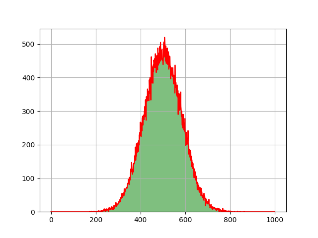
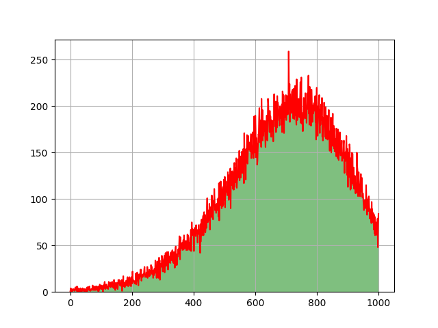
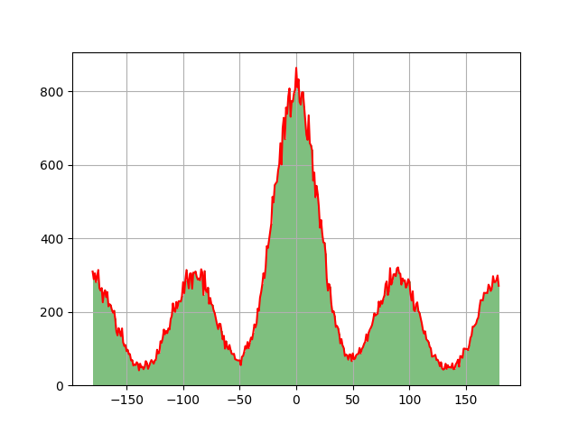
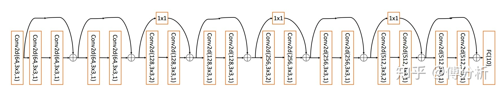
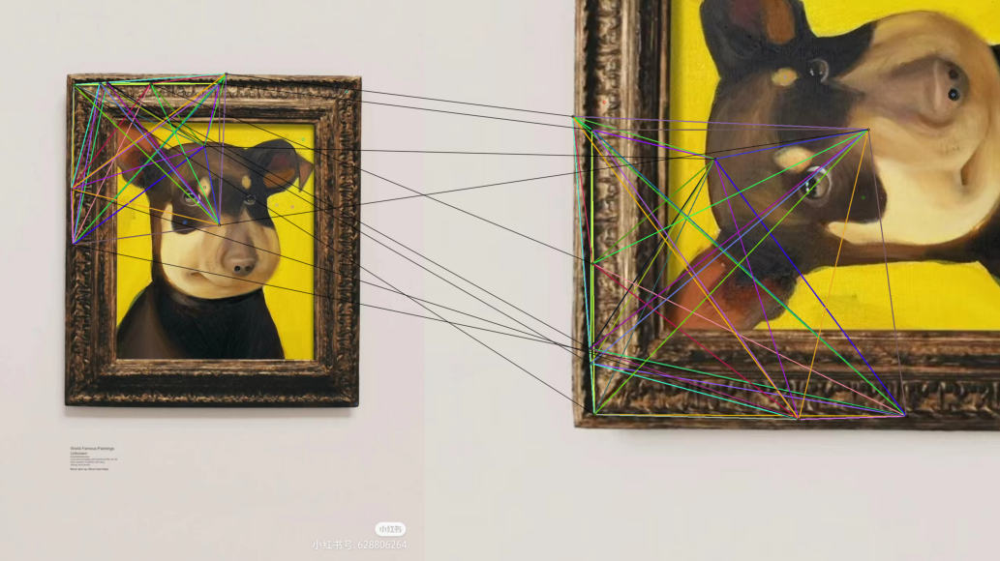
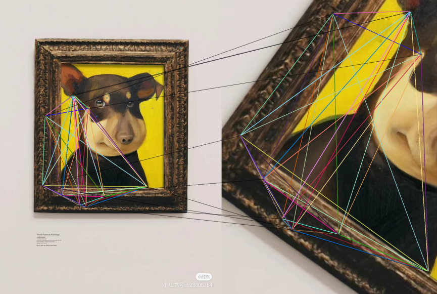

# 残缺图像检索 SDK

[toc] 

## 方法一：模板匹配


### 1.1 算法说明

* **灰度模板匹配算法**：将裁剪图视作模板，遍历图像库中的每一张图片，对模板和图片应用模板匹配算法，算法输出模板在图片中的匹配的最高相似度，作为模板（裁剪图）来自该图片的可信度，最后选出可信度最高的 5 张图图片作为检索结果。
* **优化策略**：
  * **压缩图像**，在图像比较大的时候可以使用压缩来提高速度。
  * **多角度模板匹配**：设定多个模板旋转角度和镜像模板，一旦一轮检测结束时检测到高于 thredhold 的可信度就不在进行模板的下一次旋转。
  * **多尺寸模板匹配**：设置多个缩放尺度，一旦一轮检测结束时检测到高于 thredhold 的可信度就不在进入下一个尺度。

### 1.2 函数说明

**`CroppedImageRetrieval.template_retrieval(template_img, retrieval_dir, compress_rate=4, threshold=0.8, show=True, rotate=True, zoom=True)`**

* 参数：
  * `template_img` 裁剪图片的文件路径
  * `retrieval_dir` 检索图片库的文件夹路径
  * `compress_rate` 图片长宽的压缩倍率，默认为 4
  * `threshold` 模板变换的可信度阈值，默认为 0.8
  * `show` 显示匹配图片，默认为 True
  * `rotate` 是否允许模板旋转，默认为 True
  * `zoom` 是否允许模板缩放，默认为 True

* 输出：
  * `best_match_info` 返回可信度最高的五张原图的列表，每个元素是（文件名，可信度）二元组，按可信度从大到小排序

* **提示：如果裁剪图没有没有较原图进行缩放，可以将 zoom 设置为 False；如果裁剪图没有较原图进行旋转，可以将 rotate 设为 False 以缩短检索时间。**

### 1.3 测试结果

|   数据   | 图片数目 | 准确率 | 准确率（Top5） | 平均检索时间（秒） |
| :------: | :------: | :----: | :------------: | :----------------: |
| **标签** |   172    |  100%  |      100%      |        8.83        |
| **发票** |   114    | 96.5%  |      100%      |        32.4        |
| **无线** |   178    |  100%  |      100%      |        11.3        |
| **隐患** |   190    | 96.3%  |     97.4%      |       13.92        |


## 方法二：分类神经网络

### 2.1 思路：分类神经网络

#### 2.1.1 算法步骤：

* **数据处理阶段：**

  * 将图像按照一定的概率分布随机裁剪为 128 张图像，作为训练样本。

    |       中心点选择        |        长宽选择         |          旋转角度           |
    | :---------------------: | :---------------------: | :-------------------------: |
    |  |  |  |

    其中，中心点选择和长宽选择分别遵循高斯分布和泊松分布，横坐标为图片的长或宽，旋转角度遵循混合高斯分布，横坐标从为旋转的角度（$[-180,180]$）

  * 视每一张原图为一个分类，将随机裁剪的 128 张图片（我们将每个类的前4/5的裁剪图当作训练集，剩下1/5作为验证集），将图像统一压缩成到 224x224，再输入输出神经网络（ResNet18）中进行训练。

    

* **图像检索阶段：**

  * 将待检索图片直接输入网络，跟据输出的分类结果从图片库中找到对应的原图。

#### 2.1.2 算法评价

* 优点：
  * 速度快，准确率高；
  * 鲁棒性更强，在处理经过缩放和旋转的裁剪图上效果更优于模板匹配；
  * 模型可以不断训练，提高正确率

* 缺点：
  * 可扩展性差，当新图片加入时需要从重新训练神经网络；
  * 对于如 发票图片库 这样的图像高度相似，只有小许细节（如文字）不同的图片库，模型效果较差，需要进行调整（增大输入图片的长宽，修改随机裁剪的概率分布）

### 2.2 运行说明

#### 第一步：对图片库的每一张图片生成随机裁剪图

**`CroppedImageRetrieval.images_cropping(data_path, crop_path, info_path, num=128)`**

* `data_path` **图片库所在的文件夹路径**，里面图片的数目将是分类神经网络输出的类别数

* `crop_path` **保存随机裁剪结果的文件夹路径**，该文件夹需要事先创建，随机裁剪结果将跟据各自对应的原图保存在子文件夹中

* `info_path` **保存 类别—原图映射表的文件夹路径**，该文件夹需要事先创建

* `num` **随机裁剪的数目**，默认为 128

  例如，原图保存在 `/home/xxx/Data/Tag/` 中，创建文件夹 `/home/xxx/Crop/Tag/` 以保存随机裁剪结果，创建文件夹 `/home/xxx/Info/Tag/` 以保存类别—图片映射表`info.csv`，该文件在测试时需要使用。

  ```python
  import CroppedImageRetrieval
  data_path = "/home/xxx/Data/Tag/"
  crop_path = "/home/xxx/Crop/Tag/"
  info_path = "/home/xxx/Info/Tag/"
  CroppedImageRetrieval.images_cropping(data_path, crop_path, info_path)
  ```

#### 第二步：训练模型

> 建议在 GPU 环境下训练网络，运行时间随网络的规模增大而延长。

**`CroppedImageRetrieval.model_train(data_path, model_path, class_num, epoch=5)`**

* `data_path` **随机裁剪结果的文件夹路径**，随机裁剪图由上一步生成，作为神经网络模型的输入
* `model_path` **保存训练模型的文件路径**，所在的文件夹需要事先创建，文件后缀 `pth` ，保存的模型用来实现图像检索，也可以继续训练更新保存的模型
* `class_num` **图片库图片数目**，即分类神经网络输出的类别数
* `epoch` **训练的迭代次数**，默认为 5，可以增加 Epoch 来提高模型准确率

例如， `/home/xxx/Crop/Tag/` 保存随机裁剪结果，图片数目为 172，使用 ResNet18 训练 3 个 Epoch，将模型保存至 `/home/xxx/Model/Tag/resnet.pth`

```python
import CroppedImageRetrieval
crop_path = "/home/xxx/Crop/Tag/"
model_path= "/home/xxx/Model/Tag/resnet.pth"
CroppedImageRetrieval.model_train(crop_path, model_path, 172, 3)
```

#### 第三步：残缺图像检索

**`CroppedImageRetrieval.model_test(model_path, info_path, image_path, class_num)`**

* `model_path` **保存训练模型的文件路径**，所在的文件夹需要事先创建，文件后缀 `pth` ，由上一步骤生成，保存的模型用来实现图像检索，也可以继续训练更新保存的模型
* `info_path` **类别—原图映射表的文件路径**，该文件由生成裁剪图时创建。
* `image_path` **裁剪图的文件路径**，程序将在图片库中找到该裁剪图对应的原图。
* `class_num` **图片库图片数目**，即分类神经网络输出的类别数
* 函数返回返回最有可能是原图的五张结果，以列表的形式组织

例如， `/home/xxx/Model/Tag/` 保存训练的模型，图片数目为 172，映射表的文件路径是 ` /home/xxx/Info/Tag/info.csv`，我们将寻找 `./Data/TagCut/000010.jpg` 对应的原图。

```python
import CroppedImageRetrieval
model_path = "/home/xxx/Model/Tag/resnet.pth"
info_path = "/home/xxx/Info/Tag/info.csv"
image_path = "./Data/TagCut/000010.jpg"
CroppedImageRetrieval.model_test(model_path, info_path, image_path, 172)
```

### 2.3 测试结果

> 使用的网络架构：**ResNet18**
>
> * 该模型可以继续训练，甚至可以重新生成新的一批随即裁剪进行训练。
> * 同时，在更大的图片库上进行检索时，可以考虑使用更大的深度学习模型进行训练，如 ResNet-50，ResNet-101 或其他流行的神经网络架构，同时，随机裁剪的图片数目也可以从 128 增加到 512，甚至更大。
> * **发票图片库的问题：**经过测试，我们发现原先的策略不适用于发票图片库，因为它们图片较大，差异小（仅有文字差异），轮廓基本一致；224x224 的图片压缩丢失重要信息；同时，我们跟据发票裁剪数据的分布，适当调整了裁剪概率分布。


**训练结果**：

> 对于以下四个数据集，由于数据集中存在不少几乎相同的图片，我们借助模板匹配算法检测结果，提前手动删除了重复的图片。

|   数据   | 图片（类别）数 | 训练图片数 | 训练集准确率 | 验证图片数 | 验证集准确率 |
| :------: | :------------: | :--------: | :----------: | :--------: | :----------: |
| **标签** |      172       |   17200    |  **99.57%**  |    4816    |  **98.86%**  |
| **发票** |      114       |   11400    |  **42.74%**  |    3192    |  **41.23%**  |
| **无线** |      178       |   17800    |  **97.47%**  |    4984    |  **96.19%**  |
| **隐患** |      190       |   19000    |  **99.02%**  |    5320    |  **98.65%**  |

**测试结果**：

|   数据   | 测试图片数 | 准确率（Top1） | 准确率（Top5） | CPU 平均检索时间 | GPU 平均检索时间 |
| :------: | :--------: | :------------: | :------------: | :--------------: | :--------------: |
| **标签** |    172     |   **95.35%**   |   **98.84%**   |     0.15 秒      |     0.08 秒      |
| **发票** |    114     |   **14.04%**   |   **41.23%**   |     0.25 秒      |     0.15 秒      |
| **无线** |    178     |   **96.07%**   |   **98.88%**   |     0.16 秒      |     0.12 秒      |
| **隐患** |    190     |   **96.32%**   |   **99.47%**   |     0.18 秒      |     0.09 秒      |


## 方法三：特征点距离之比的方差【新】

### 3.1 算法说明

#### 3.1.1 基本思路

* 因为原图和裁剪图本质上是一张图片，那么对于裁剪图上任意的两个点，在原图上必定存在对应的两个点，裁剪图上两点距离和原图对应的两点距离的比值等于裁剪图对于原图的缩放比例，是一个定值。

* 既然如此，可以通过特征提取算法，如 **SIFT, SURF, ORB** 等尺度、旋转不变性特征提取算法，提取特征点和特征向量；再通过匹配器，如快速近似紧邻匹配器，可以得到裁剪图与原图点的匹配对；考虑到不是所有匹配都是准确的，我们从匹配结果中选择最好的 $npairs$ 个匹配对；利用匹配对计算图片任意两个特征点的距离在原图上和在特征图上的比值；最后计算比值的方差，显然因为裁剪图和原图的比值为定值，故方差就应该为零。

* 跟据这个思路可以设计一个匹配算法，取两两特征点距离比的方差作为度量，方差越小，匹配度越高。

  |  |  |
  | ----------------------------- | ----------------------------- |

  上面为两个匹配例子，例一中两图匹配方差为 1.6e-06，例二中两图匹配方差为：4.2e-06。（参数：ver="SURF", ori_nfeatures=2000, crop_nfeatures=2000, ori_nkeeps=2000, crop_nkeeps=2000, npairs=10）

#### 3.1.2 算法步骤

* **算法参数**：

  | 参数   | ver  | ori_nfeatures | crop_nfeatures | ori_nkeeps | crop_nkeeps | npairs |
  | ------ | ---- | ------------- | -------------- | ---------- | ----------- | ------ |
  | 默认值 | SURF | 1500          | 500            | 1500       | 500         | 20     |

  * **ver**：所采取的特征提取算法："SIFT", "ORB", "SURF"
  * **ori_nfeatures**：预处理时，对原图进行特征提取的特征点数目，其按照局部对比度排序，即保留的最佳特征的数量
  * **crop_nfeatures**：检索时，对裁剪图进行特征提取的特征点数目，其按照局部对比度排序，即保留的最佳特征的数量
  * **ori_nkeeps**：预处理时，对原图进行特征提取后，在提取的特征点中随机选取，最终保留的特征点数目，用于减少匹配时间
  * **crop_nkeeps**：检索时，对裁剪图进行特征提取后，在提取的特征点中随机选取，最终保留的特征点数目，用于减少匹配时间
  * **npairs**：选取匹配对的个数

* **数据处理阶段：**输入原图图片库

  * 提取图库中每一张图的 $ori\_nfeatures$ 个特征点的位置和特征向量，从中随机选取 $ori\_nkeeps$ 个分别保存在文件中。

* **图像检索阶段：**输入裁剪图和原图图片库的特征文件

  1. 提取裁剪图 $I_{crop}$ 的 $crop\_nfeatures$ 个特征点信息，随机保留 $crop\_nkeeps$ 个，设每一个特征点用 $pt_{crop}^{(i)}$ 表示，每一个特征点对应的特征向量用 $des_{crop}^{(i)}$ 表示；

  2. 遍历图片库的每一张图片 $I_{ori}$，执行以下步骤：

     1. 读取图片  $I_{ori}$ 的特征点信息 $pt_{ori}$ 和 $des_{ori}$；

     2. 使用快速近似紧邻算法（opencv.FLANN）寻找 $I_{ori}$ 和 $I_{crop}$ 的特征点匹配对；

     3. 选出匹配度最高的前 $npairs$ 个特征点对 $<pt_{crop}^{(j)}, pt_{ori}^{(k)}>^{(m)}$，其中 $pt_{crop}^{(j)}$ 指裁剪图 $I_{crop}$ 的第 $j$ 个特征点，$pt_{ori}^{(k)}$ 指图库图片 $I_{ori}$ 的第 $k$ 个特征点，$<,>^{(m)}$ 表示第 $m$ 个特征点对；

     4. 对于任意两个特征点对$<pt_{crop}^{(j)}, pt_{ori}^{(k)}>^{(m)}$和$<pt_{crop}^{(j')}, pt_{ori}^{(k')}>^{(n)}, m \neq n$，计算两特征点对的距离比：
        $$
        d^{(m,n)} = \frac{dis(pt_{crop}^{(j)}, pt_{crop}^{(j')})+1}{dis(pt_{ori}^{(k)}, pt_{ori}^{(k')})+1}
        $$
        其中，$dis(p, q)$ 指计算两个点的欧氏距离 $\sqrt{(p_x - q_x)^2 + (p_y - q_y)^2}$；

     5. 计算 $d^{(m,n)}, m, n \in [0, npairs], m \neq n$ 的方差 $\sigma$，作为图片 $I_{crop}$ 与图片 $I_{ori}$ 的方差；

  3. 选择与 $I_{crop}$ 方差最小的图片 $I_{ori'}$，作为检索结果。

#### 3.1.3 算法优化

1. 使用 Pandas 库进行特征文件压缩与快速读写

2. 存储冗余：一张图片特征点多，最后真正用到的只有几十个，设置参数随机丢弃一部分特征点

3. 计算距离比时，使用拉普拉斯平滑。

   > 因为匹配过程，会匹配重复的特征点，导致原图中两特征点距离为 0，无法计算比值，进而导致计算方差时错误样本方差虚低。

4. 在计算方差之前，利用正态分布的3-Sigma原则去除离群值，以增加鲁棒性。

   > 对此为算法新增了一个参数 use3sigma，默认为 False，为 True 时进行离群值剔除。


### 3.2 函数说明

> **REQUIREMENT:**
>
> Visit https://blog.csdn.net/MOZHOUH/article/details/123924038 for help
>
> python                3.7
> opencv-contrib-python 3.4.2.17
> opencv-python         3.4.2.17
> pandas                1.3.5

**`CroppedImageRetrieval.sift_match(ori_image_path, crop_image_path, show=2, ver="SURF", ori_nfeatures=1500, crop_nfeatures=500, ori_nkeeps=1500, crop_nkeeps=500, npairs=20, use3sigma=False)`**

* SIFT_MATCH 残缺图像匹配算法
* 参数
  * `ori_image_path`: 原图的文件路径
  * `crop_image_path`: 裁剪图的文件路径
  * `show`: [0, 1, 2] show=1 时打印耗时、结果，show=2 时输出匹配的可视化
  * `ver`: 所采取的特征提取算法，支持 "SIFT", "ORB", "SURF"
  * `ori_nfeatures`: 预处理时，对原图进行特征提取的特征点数目，其按照局部对比度排序，即保留的最佳特征的数量
  * `crop_nfeatures`: 检索时，对裁剪图进行特征提取的特征点数目，其按照局部对比度排序，即保留的最佳特征的数量
  * `ori_nkeeps`: 预处理时，对原图进行特征提取后，在提取的特征点中随机选取，最终保留的特征点数目，用于减少匹配时间
  * `crop_nkeeps`: 检索时，对裁剪图进行特征提取后，在提取的特征点中随机选取，最终保留的特征点数目，用于减少匹配时间
  * `npairs`: 选取匹配对的个数
  * `use3sigma`：=True 时，计算方差剔除离群值
* 输出
  * `var_dis`: 两张图片的方差

**`CroppedImageRetrieval.preprocess(path_dir, target_dir, ver="SURF", ori_nfeatures=1500, ori_nkeeps=1500, fcheck=True)`**

* PREPROCESS 残缺图像检索预处理
* 参数
  * `path_dir`: 待检索的图片库文件夹路径
  * `target_dir`: 保存特征文件的目标文件夹路径
  * `ver`: 所采取的特征提取算法，支持 "SIFT", "ORB", "SURF"
  * `ori_nfeatures`: 预处理时，对原图进行特征提取的特征点数目，其按照局部对比度排序，即保留的最佳特征的数量
  * `ori_nkeeps`: 预处理时，对原图进行特征提取后，在提取的特征点中随机选取，最终保留的特征点数目，用于减少匹配时间
  * `fcheck`: =True 时进行文件检查，如果特征文件已经存在则不再重新生成

**`CroppedImageRetrieval.load_feature(feature_dir)`**

* LOAD_FEATURE 载入特征文件
* 参数
  * `feature_dir`: 特征文件所在的文件夹路径
* 输出
  * `images_feature`: 字典结构，以图片名为键， 以特征点和特征描述符组成的元组为值

**`CroppedImageRetrieval.sift_retrieval(crop_path, images_feature, ver="SURF", crop_nfeatures=1500, crop_nkeeps=1500, npairs=20, use3sigma=False)`**

* SIFT_RETRIEVAL 残缺图像检索算法
* 参数
  * `crop_path`: 裁剪图的文件路径
  * `images_feature`：待检索图库的特征，字典结构，以图片名为键， 以特征点和特征描述符组成的元组为值
  * `ver`: 所采取的特征提取算法，支持 "SIFT", "ORB", "SURF"
  * `crop_nfeatures`: 检索时，对裁剪图进行特征提取的特征点数目，其按照局部对比度排序，即保留的最佳特征的数量
  * `crop_nkeeps`:  检索时，对裁剪图进行特征提取后，在提取的特征点中随机选取，最终保留的特征点数目，用于减少匹配时间
  * `npairs`: 选取匹配对的个数
  * `use3sigma`：计算方差时剔除离群值
* 输出
  * `res`: 检索结果，元组（文件名，方差）的列表，按方差从小到大排序

#### QuickStart

图片检索，假设原图库保存在：`C:\Ori\`，裁剪图片： `C:\Crop\1.jpg`，按照以下步骤完成算法：

1. 新建一个文件夹 `C:\\Features\\` 保存特征文件

2. 生成特征文件：

   ``` python
   import CroppedImageRetrieval
   path_dir = "C:\\Ori\\"
   target_dir = "C:\\Features\\"
   CroppedImageRetrieval.preprocess(path_dir, target_dir)
   ```

3. 载入特征文件

   ```python
   feature_dir = "C:\\Features\\"
   images_feature = CroppedImageRetrieval.load_feature(feature_dir)
   ```

4. 裁剪图像检索

   ```python
   crop_path = "C:\\Crop\\1.jpg"
   res = CroppedImageRetrieval.sift_retrieval(crop_path, images_feature)
   print(res)
   ```

   

### 3.3 测试结果

算法有七个超参，以下结果对应的超参数组合为：ver="SURF", ori_nfeatures=1500, crop_nfeatures=1500, ori_nkeeps=500, crop_nkeeps=500, npairs=20, use3sigma=False，更多测试结果在详细报告中。该参数组对应编号 "5051"，准确率高，耗时较短。

|   数据   | 图片数目 | 准确率 | 准确率（Top5） | 平均检索时间（秒） |
| :------: | :------: | :----: | :------------: | :----------------: |
| **标签** |   169    |  100%  |      100%      |        3.43        |
| **发票** |   112    |  100%  |      100%      |        3.08        |
| **无线** |   178    | 99.4%  |     99.4%      |        4.24        |
| **隐患** |   190    | 98.9%  |     98.9%      |        4.14        |


## BugFix 日志

* 2022.7.1 修改了模板匹配算法对模板进行缩放时的错误，并增加了两个缩放尺度：[0.5,2] -> [0.5, 0.75, 1.5, 2]。