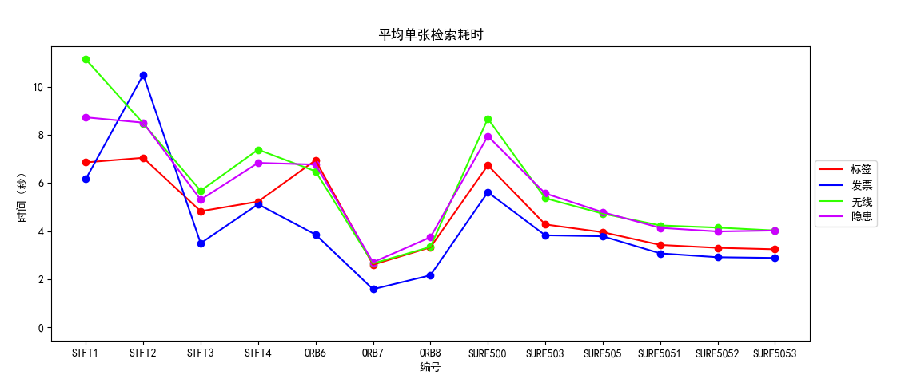

# 残缺图像检索 V3

[toc]

## 一、问题梳理

* 梳理问题：
  * 输入：一张经裁剪的图像和一个图像库
  * 输出：一张源自图像库的图片，是输入裁剪图的原图
* 难点：

  * 裁剪图经旋转、变形、缩放、像素值重编码

## 二、思路：特征点距离方差

### 2.1 算法思路

* 因为原图和裁剪图本质上是一张图片，那么对于裁剪图上任意的两个点，在原图上必定存在对应的两个点，裁剪图上两点距离和原图对应的两点距离的比值等于裁剪图对于原图的缩放比例，是一个定值。

* 既然如此，可以通过特征提取算法，如 **SIFT, SURF, ORB** 等尺度、旋转不变性特征提取算法，提取特征点和特征向量；再通过匹配器，如快速近似紧邻匹配器，可以得到裁剪图与原图点的匹配对；考虑到不是所有匹配都是准确的，我们从匹配结果中选择最好的 $npairs$ 个匹配对；利用匹配对计算图片任意两个特征点的距离在原图上和在特征图上的比值；最后计算比值的方差，显然因为裁剪图和原图的比值为定值，故方差就应该为零。

* 跟据这个思路可以设计一个匹配算法，取两两特征点距离比的方差作为度量，方差越小，匹配度越高。

  |  |  |
  | ----------------------------- | ----------------------------- |

  上面为两个匹配例子，例一中两图匹配方差为 1.6e-06，例二中两图匹配方差为：4.2e-06。（参数：ver="SURF", ori_nfeatures=2000, crop_nfeatures=2000, ori_nkeeps=2000, crop_nkeeps=2000, npairs=10）

### 2.2 算法步骤

* **数据处理阶段：**输入原图图片库

  * 第一步：提取图库中每一张图的 $ori\_nfeatures$ 个特征点的位置和特征向量，从中随机选取 $ori\_nkeeps$ 个分别保存在文件中。

* **图像检索阶段：**输入裁剪图和原图图片库的特征文件

  1. 提取裁剪图 $I_{crop}$ 的 $crop\_nfeatures$ 个特征点信息，随机保留 $crop\_nkeeps$ 个，每一个特征点用 $pt_{crop}^{(i)}$ 表示，每一个特征点对应的特征向量用 $des_{crop}^{(i)}$ 表示；

  2. 遍历图片库的每一张图片 $I_{ori}$，执行以下步骤：

     1. 读取图片  $I_{ori}$ 的特征点信息 $pt_{ori}$ 和 $des_{ori}$；

     2. 使用快速近似紧邻算法（opencv.FLANN）寻找 $I_{ori}$ 和 $I_{crop}$ 的特征点匹配对；

     3. 选出匹配度最高的前 $npairs$ 个特征点对 $<pt_{crop}^{(j)}, pt_{ori}^{(k)}>^{(m)}$，其中 $pt_{crop}^{(j)}$ 指裁剪图 $I_{crop}$ 的第 $j$ 个特征点，$pt_{ori}^{(k)}$ 指图库图片 $I_{ori}$ 的第 $k$ 个特征点，$<,>^{(m)}$ 表示第 $m$ 个特征点对；

     4. 对于任意两个特征点对$<pt_{crop}^{(j)}, pt_{ori}^{(k)}>^{(m)}$和$<pt_{crop}^{(j')}, pt_{ori}^{(k')}>^{(n)}, m \neq n$，计算两特征点对的距离比：
        $$
        d^{(m,n)} = \frac{dis(pt_{crop}^{(j)}, pt_{crop}^{(j')})+1}{dis(pt_{ori}^{(k)}, pt_{ori}^{(k')})+1}
        $$
        其中，$dis(p, q)$ 指计算两个点的欧氏距离 $\sqrt{(p_x - q_x)^2 + (p_y - q_y)^2}$；

     5. 计算 $d^{(m,n)}, m, n \in [0, npairs], m \neq n$ 的方差 $\sigma$，作为图片 $I_{crop}$ 与图片 $I_{ori}$ 的方差；

  3. 选择与 $I_{crop}$ 方差最小的图片 $I_{ori'}$，作为检索结果。

### 2.2 算法优化

1. 使用 Pandas 库进行特征文件压缩于读写，加速明显

2. 存储冗余：一张图片特征点多，最后真正用到的只有几十个，设置参数随机丢弃一部分特征点

3. 计算距离比时，使用拉普拉斯平滑。

   > 因为匹配过程，会匹配重复的特征点，导致原图中两特征点距离为 0，无法计算比值，进而导致计算方差时错误样本方差虚低。

4. 在计算方差之前，利用正态分布的3-Sigma原则去除离群值，以增加鲁棒性。

   |                                                              |                                         |
   | :----------------------------------------------------------- | :-------------------------------------: |
   | 以右图为例子，在参数（ver="SURF", ori_nfeatures=2000, crop_nfeatures=2000, ori_nkeeps=2000, crop_nkeeps=2000, npairs=10）下，直接计算方差结果为 0.525 ，而使用离群值删除下计算得到的方差为 7.72e-6. |  |

### 2.3 算法评价

* 优点：

  * 抗旋转抗缩放，准确度高，时间较快；

  * 可以一次找出最优的多个答案。

* 缺点：

  * 无法直接识别镜像图片；

  * FLANN匹配过程较慢；
  * 检索过程即将裁剪图与图片库的每一张图片匹配，不适用于大型图片库。

* 匹配失败的例子：

  

## 三、测试

### 3.1 调参

#### 参数说明：

* **ver**：所采取的特征提取算法

  * SIFT, ORB, SURF

* **ori_nfeatures**：预处理时，对原图进行特征提取的特征点数目 将按照局部对比度排序，即保留的最佳特征的数量
  * ORB 默认为 500，SIFT 则会提取所有

* **crop_nfeatures**：检索时，对裁剪图进行特征提取的特征点数目 其按照局部对比度排序，即保留的最佳特征的数量 
  * ORB 默认为 500，SIFT 则会提取所有

* **ori_nkeeps**：预处理时，对原图进行特征提取后，在提取的特征点中随机选取，最终保留的特征点数目，用于减少匹配时间

* **crop_nkeeps**：检索时，对裁剪图进行特征提取后，在提取的特征点中随机选取，最终保留的特征点数目，用于减少匹配时间

* **npairs**：选取匹配对的个数

#### 测试说明

* 我们基于四个场景图片库（标签、发票、无线、隐患）进行测试。图片库的每一张图片都有一张裁剪图与之配对。同时，我们提前对图片进行了筛选，确保图片库中没有相同的图片。四个图片库的图片数目分别是：

  | 图片库       | 标签 | 发票 | 无线 | 隐患 |
  | ------------ | ---- | ---- | ---- | ---- |
  | **图片数目** | 169  | 112  | 178  | 190  |

* 给定的裁剪图的裁剪强度一般，几乎没有进行旋转和缩放。为了测试算法在面对旋转和缩放时的效果，我们生成了一份额外的经随机旋转和缩放的裁剪图样本，这组裁剪图在检索时更具有难度。使用这组裁剪样本测试时，不同参数下算法性能好坏表现的更明显。

#### 测试参数组合

* **SIFT 组**

  | 编号  | ver  | ori_nfeatures | crop_nfeatures | ori_nkeeps | crop_nkeeps | npairs |
  | :---: | :--: | :-----------: | :------------: | :--------: | :---------: | :----: |
  | **1** | SIFT |     5000      |      5000      |    2000    |    2000     |   50   |
  | **2** | SIFT |     5000      |      2000      |    5000    |    2000     |   50   |
  | **3** | SIFT |     2000      |      2000      |    1000    |    1000     |   20   |
  | **4** | SIFT |     2000      |      1000      |    2000    |    1000     |   20   |

* **ORB 组**

  | 编号  | ver  | ori_nfeatures | crop_nfeatures | ori_nkeeps | crop_nkeeps | npairs |
  | :---: | :--: | :-----------: | :------------: | :--------: | :---------: | :----: |
  | **6** | ORB  |     2000      |      2000      |    2000    |    2000     |   50   |
  | **7** | ORB  |     2000      |      2000      |    1000    |    1000     |   20   |
  | **8** | ORB  |     2000      |      1000      |    2000    |    1000     |   20   |

* **SURF 组**

  |  编号   |   ver    | ori_nfeatures | crop_nfeatures | ori_nkeeps | crop_nkeeps | npairs |
  | :-----: | :------: | :-----------: | :------------: | :--------: | :---------: | :----: |
  | **500** | SURF |   2000    |    2000    |  2000  |  2000   | 50 |
  | **503** | SURF |   2000    |    500     |  2000  |   500   | 50 |
  | **505** | SURF |   1500    |    500     |  1500  |   500   | 50 |
| **5051** | SURF |   1500    |    500     |  1500  |   500   | 20 |
| **5052** | SURF |   1500    |    500     |  1500  |   500   | 10 |
| **5053** | SURF |   1500    |    500     |  1500  |   500   | 5  |

### 3.2 测试结果

> **测试说明**：以下测试结果的测试代码并未采用3-Sigma原则剔除离群值，采用3-Sigma原则剔除离群值的测试结果保存在 测试结果汇总.md 中。测试表明：剔除离群值能显著提高困难图片库的测试正确率，但会是简单图片库的正确率降低。

#### 正确率

* SIFT 组

  |   编号   |       标签        |       发票        |       无线        |       隐患        |
  | :------: | :---------------: | :---------------: | :---------------: | :---------------: |
  |  **1**   |   92.9% / 92.9%   |   99.1% / 100%    |   84.8% / 86.5%   |   97.9% / 98.4%   |
  |  **2**   |   88.8% / 88.8%   |  **100% / 100%**  | **88.8% / 90.4%** |   97.9% / 98.9%   |
  |  **3**   |  **100% / 100%**  |  **100% / 100%**  |   65.7% / 69.1%   | **98.9% / 100%**  |
  |  **4**   |   99.4% / 100%    |  **100% / 100%**  |   78.9% / 79.8%   | **98.9% / 100%**  |
  | **编号** |  **标签(hard)**   |  **发票(hard)**   |  **无线(hard)**   |  **隐患(hard)**   |
  |  **1**   |   62.1% / 66.9%   |   41.9% / 53.5%   |   67.9% / 78.1%   |   65.7% / 70.5%   |
  |  **2**   |   62.7% / 66.9%   | **54.5% / 70.5%** | **72.5% / 77.5%** |   75.8% / 79.5%   |
  |  **3**   | **85.8% / 95.3%** |   30.4% / 39.3%   |   52.8% / 64.0%   |   71.5% / 76.8%   |
  |  **4**   |   81.1% / 95.3%   |   43.8% / 57.1%   |   71.3% / 77.0%   | **82.6% / 86.8%** |

* ORB 组

  |   编号   |       标签        |       发票        |       无线        |       隐患        |
  | :------: | :---------------: | :---------------: | :---------------: | :---------------: |
  |  **6**   |   99.4% / 100%    |   70.5% / 74.1%   |   49.4% / 55.1%   |   97.9% / 98.4%   |
  |  **7**   |  **100% / 100%**  |   61.6% / 66.1%   |   47.8% / 52.8%   |   96.3% / 97.3%   |
  |  **8**   |  **100% / 100%**  | **90.2% / 93.8%** | **70.8% / 74.2%** | **98.4% / 98.9%** |
  | **编号** |  **标签(hard)**   |  **发票(hard)**   |  **无线(hard)**   |  **隐患(hard)**   |
  |  **6**   |   79.9% / 86.4%   | **42.9% / 60.7%** |   39.3% / 45.5%   |   51.6% / 56.8%   |
  |  **7**   |   75.1% / 81.1%   |   33.0% / 48.2%   |   32.0% / 35.4%   |   47.9% / 52.1%   |
  |  **8**   | **80.5% / 89.3%** |   26.7% / 49.1%   | **52.8% / 56.2%** | **66.8% / 71.5%** |

* SURF 组

  |   编号   |       标签        |       发票        |       无线        |       隐患        |
  | :------: | :---------------: | :---------------: | :---------------: | :---------------: |
  | **500**  |   99.4% / 100%    |  **100% / 100%**  | **99.4% / 99.4%** | **99.5% / 99.5%** |
  | **503**  |  **100% / 100%**  |  **100% / 100%**  | **99.4% / 99.4%** |   98.9% / 98.9%   |
  | **505**  |  **100% / 100%**  |  **100% / 100%**  | **99.4% / 99.4%** |   98.9% / 99.4%   |
  | **编号** |  **标签(hard)**   |  **发票(hard)**   |  **无线(hard)**   |  **隐患(hard)**   |
  | **500**  |   71.0% / 81.1%   | **46.4% / 53.5%** |   85.3% / 91.0%   |   85.3% / 89.5%   |
  | **503**  | **89.3% / 94.1%** |   41.1% / 50.1%   | **90.4% / 93.8%** | **86.3% / 92.1%** |
  | **505**  |   88.1% / 94.1%   |   41.2% / 50.0%   |   86.5% / 91.6%   |   85.2% / 90.5%   |

  |   编号   |       标签        |       发票        |       无线        |       隐患        |
  | :------: | :---------------: | :---------------: | :---------------: | :---------------: |
  | **5051** |  **100% / 100%**  |  **100% / 100%**  | **99.4% / 99.4%** | **98.9% / 98.9%** |
  | **5052** |   99.4% / 100%    |  **100% / 100%**  | **99.4% / 99.4%** |   98.4% / 99.4%   |
  | **5053** |   98.8% / 99.4%   |  **100% / 100%**  | **99.4% / 99.4%** |   96.8% / 98.9%   |
  | **编号** |  **标签(hard)**   |  **发票(hard)**   |  **无线(hard)**   |  **隐患(hard)**   |
  | **5051** | **87.0% / 94.6%** | **40.2% / 52.7%** | **94.4% / 97.2%** |   85.8% / 88.9%   |
  | **5052** |   87.0% / 93.5%   |   37.5% / 47.3%   |   90.4% / 96.1%   | **87.4% / 92.1%** |
  | **5053** |   82.8% / 93.4%   |   37.5% / 49.1%   |   82.6% / 93.8%   |   82.6% / 91.5%   |

* 以测试组编号为横坐标，不同曲线表示在不同图片库上测试的检索准确率：可以看到使用SURF特征的几组效果较优且稳定。

  > 从图中可以看到发票(hard)测是准确率较低，其原因是不同发票图片高度相似，随机裁剪、缩放使得发票的重要细节丢失，导致效果不佳。

* 以不同图片库为横坐标，不同曲线使用不同参数组合下的检索准确率：从此图中可以明显看出蓝色标识的SURF组效果更佳，其次是以红色标识的SIFT组。

* 对于SURF参数组测试的单独可视化如下：

|  |  |
| ------------------- | --------------------- |

#### 算法耗时

* SIFT 组

  | 编号  |   标签   |   发票   |   无线   |   隐患   |
  | :---: | :------: | :------: | :------: | :------: |
  | **1** |   6.86   |   6.17   |  11.14   |   8.73   |
  | **2** |   7.05   |  10.50   |   8.48   |   8.51   |
  | **3** | **4.83** | **3.50** | **5.68** | **5.31** |
  | **4** |   5.23   |   5.12   |   7.39   |   6.84   |

* ORB 组

  | 编号  |   标签   |   发票   |   无线   |   隐患   |
  | :---: | :------: | :------: | :------: | :------: |
  | **6** |   6.95   |   3.86   |   6.49   |   6.77   |
  | **7** | **2.61** | **1.59** | **2.66** | **2.71** |
  | **8** |   3.33   |   2.17   |   3.35   |   3.75   |

* SURF 组

  |  编号   |   标签   |   发票   |   无线   |   隐患   |
  | :-----: | :------: | :------: | :------: | :------: |
  | **500** |   6.74   |   5.62   |   8.68   |   7.95   |
  | **503** |   4.28   |   3.83   |   5.37   |   5.57   |
  | **505** | **3.96** | **3.79** | **4.73** | **4.79** |

  |   编号   |   标签   |   发票   |   无线   |   隐患   |
  | :------: | :------: | :------: | :------: | :------: |
  | **5051** |   3.43   |   3.08   |   4.24   |   4.14   |
  | **5052** |   3.31   |   2.92   |   4.15   | **3.99** |
  | **5053** | **3.25** | **2.89** | **4.03** |   4.03   |

* 算法耗时可视化：经过对参数的优化，SURF505、SURF5051参数组合可以确保在算法耗时较低的情况下保证较高的准确率。

|  |  |
| --------------------- | ------------------- |

## 四、总结

本次实验基于尺度不变特征变换特征提出了一种 残缺图像检索 / 相同图像搜索 / 同图搜索 的方法。算法跟据裁剪图和原图的特征点间的距离的比值计算方差，作为匹配的标准。

经过一系列参数测试，得到一组准确率高，速度较快的参数组合。算法在四个图片库测试表现良好，TOP1 准确率分别为 100%、100%、99.4%、98.9%，整体上优于模板匹配和分类网络算法。
